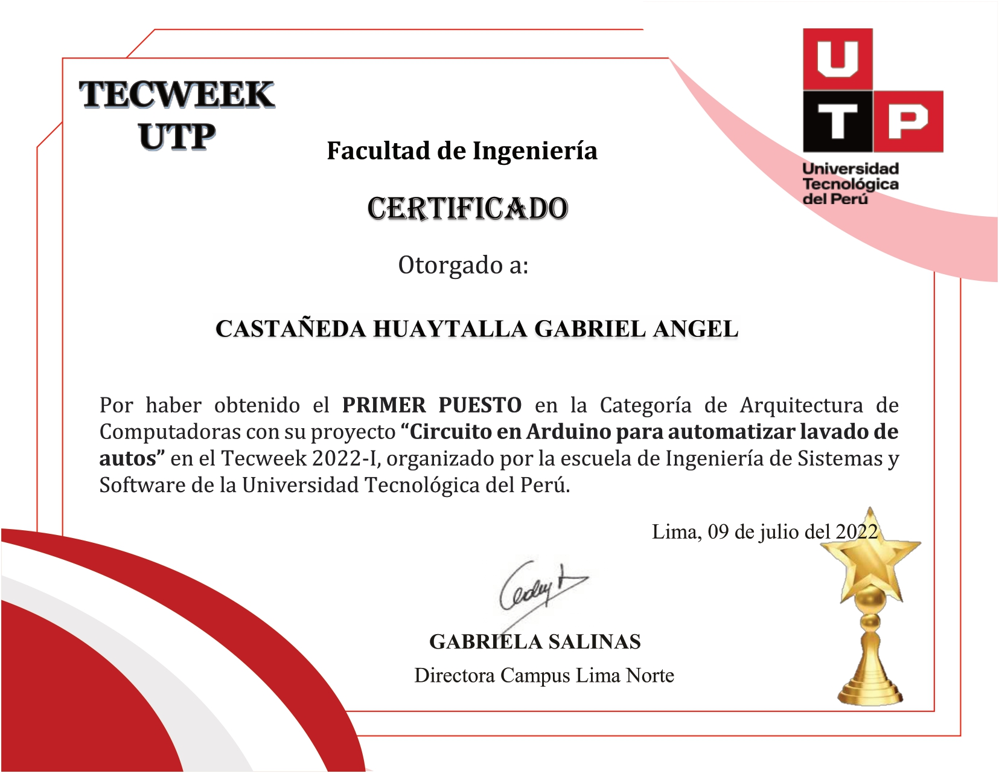

# 🤖 Circuito en Arduino para automatizar lavado de autos — Tecweek 2022-I

**Resumen:**
Diseño e implementación de un **sistema automatizado de lavado de autos** utilizando Arduino.
Ganador del **primer puesto** en la categoría *Arquitectura de Computadoras* en el **Tecweek 2022-I**, organizado por la **Escuela de Ingeniería de Sistemas y Software – UTP**.

**Tecnologías:** Arduino · Sensores · Actuadores · Programación C/C++

---

---

## ✨ Características clave

* Control automatizado de agua, jabón y secado mediante Arduino.
* Integración de sensores para detección de vehículo y ciclos de lavado.
* Programación modular en C/C++ para escalabilidad del sistema.
* Diseño enfocado en eficiencia energética y seguridad.

---

## 📂 Estructura del repo

* `assets/` → GIFs, imágenes y capturas de demostración.

---

## 🔒 Código

El proyecto completo (circuitos, diagramas y código fuente en Arduino) está en un **repositorio privado** por motivos de propiedad intelectual.

**Acceso al código:** disponible bajo solicitud (puedo invitarte a ver el repo privado).

---

## 📬 Contacto / CV

Si quieres revisar el código o una demo privada, escríbeme a: **[tu.email@ejemplo.com](mailto:tu.email@ejemplo.com)**

